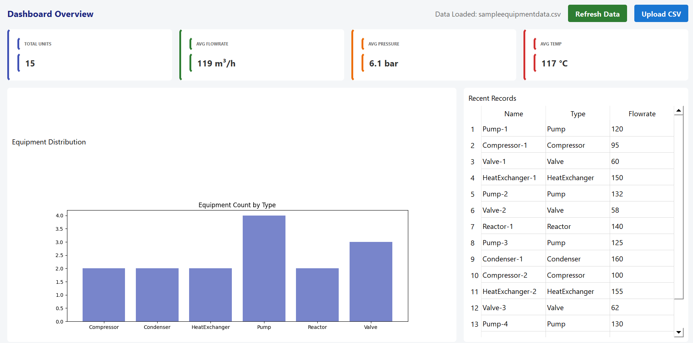
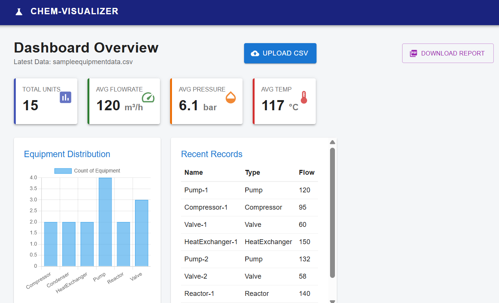

# Chemical Equipment Parameter Visualizer

<br />

- **🔴 Live Web Demo:** [https://chemical-visualizer-seven.vercel.app/](https://chemical-visualizer-seven.vercel.app/)
- **☁️ Live Backend API:** [https://chemicalvisualizer-4c97.onrender.com](https://chemicalvisualizer-4c97.onrender.com)

---

## 👨‍💻 Project Overview

This is a **Hybrid Analytics Platform** I built to demonstrate how a single backend can power multiple frontend interfaces. The goal was to create a seamless system where a user (like a chemical engineer) could upload data via a desktop app, and a manager could view the analysis instantly on a web dashboard.

It’s a full-stack application that parses chemical equipment data (Flowrate, Pressure, Temperature), calculates key statistics using Pandas, and visualizes the results in real-time.

**What makes this special:**
It’s not just two separate apps. The **Django Backend** acts as the central brain. If you upload a file on the **PyQt5 Desktop App**, the **React Web Dashboard** updates instantly.

## 🛠️ Tech Stack

* **Backend:** Python Django + REST Framework (The API & Logic)
* **Data Processing:** Pandas (For CSV parsing & math)
* **Web Frontend:** React.js + Material UI + Chart.js
* **Desktop Frontend:** Python PyQt5 + Matplotlib
* **Database:** SQLite (Lightweight & fast)
* **Reporting:** ReportLab (PDF Generation)

## 🔑 Key Features

* **True Hybrid Sync:** Upload on Desktop -> View on Web. The data is always synchronized.
* **Automated Analysis:** You don't need to calculate averages manually. The system automatically computes Flowrate, Pressure, and Temperature stats upon upload.
* **Visualizations:**
    * **Web:** Interactive bar charts and responsive KPI cards.
    * **Desktop:** Native plotting embedded directly into the window.
* **PDF Reports:** Generates a downloadable, timestamped PDF summary of the current dataset with one click.
* **Smart Storage:** To keep things clean, the system automatically manages the database, keeping only the last 5 uploaded datasets.

## 📸 Screenshots

<p align="center">
  
  <br/>
  <em>React Web Dashboard with Analytics</em>
</p>

<p align="center">
  
  <br/>
  <em>PyQt5 Desktop Interface</em>
</p>

---

## 🚀 Installation & Setup Guide

To run this locally, you'll need **3 separate terminal windows** (one for the backend, one for the web app, and one for the desktop app).

### 1️⃣ Backend Setup (Terminal 1)
*This must be running first.*

```bash
# 1. Navigate to the project root
cd ChemicalProject

# 2. Create and activate virtual environment
python -m venv venv
# Windows:
venv\Scripts\activate
# Mac/Linux:
source venv/bin/activate

# 3. Install dependencies
pip install django djangorestframework pandas django-cors-headers reportlab

# 4. Run migrations & Start Server
python manage.py makemigrations
python manage.py migrate
python manage.py runserver

```
2️⃣ Web Dashboard Setup (Terminal 2)
```
# 1. Navigate to web folder
cd frontend-web

# 2. Install dependencies
npm install

# 3. Start the React server
npm start

```
3️⃣ Desktop App Setup (Terminal 3)
```
# 1. Navigate to desktop folder
cd frontend-desktop

# 2. Activate the SAME virtual environment as the backend
# Windows:
..\venv\Scripts\activate
# Mac/Linux:
source ../venv/bin/activate

# 3. Install desktop libraries
pip install PyQt5 requests matplotlib

# 4. Run the desktop app
python main.py

```

👤 Author
Chilla Sai Charan